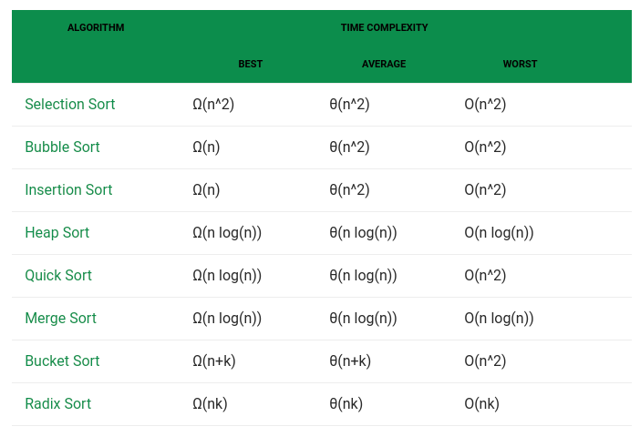

## Rearrange Array Elements to find the maximum number combination

### Problem
Rearrange Array Elements so as to form two number such that their sum is maximum. Return these two numbers. You can assume that all array elements are in the range [0, 9]. The number of digits in both the numbers cannot differ by more than 1. You're not allowed to use any sorting function that Python provides and the expected time complexity is O(nlog(n)).

for e.g. [1, 2, 3, 4, 5]

The expected answer would be [531, 42]. Another expected answer can be [542, 31]. In scenarios such as these when there are more than one possible answers, return any one.

### Solution
- To get the maximum number with time complexity of O(nlogn).

### Strategy
- we will need 2 combination with the first digit being the highest number possible. 
  - if there is number from 0..9.
  - we pick 9 for first number, 8 for second number
  - then we pick 7 for first number to become 97, and 6 for second number to become 86
  - and so on.

### Solution
- To get the maximum number with time complexity of O(nlogn).

### Strategy
- we will need 2 combination with the first digit being the highest number possible. 
  - if there is number from 0..9.
  - we pick 9 for first number, 8 for second number
  - then we pick 7 for first number to become 97, and 6 for second number to become 86
  - and so on.
- Traverse an already sorted array is O(n)
- The main issue is to pick a sorting method that has O(nlog(n)). Below are table of sort algorithm and it's performance

- I decide to use `mergesort` as the sorting algorithm